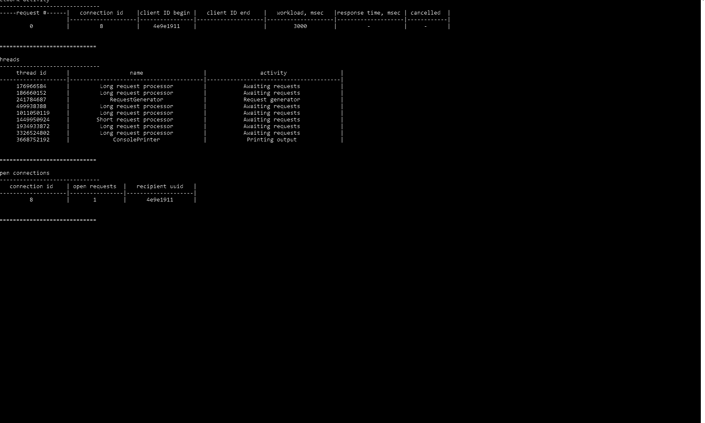

# BrightPatternTest
 
This is a simulation of a network server that would accept requests and process them in a concurrent manner

A lot of decisions in this project are exactly as I would do in a larger project

Some features used are only available in C++20

## Important decisions:
- Requests are processed with the special `RequestProcessor` class
- `RequestProcessor` is done with a threadpool
- Network::shouldExit() from the original code is omitted as it seems a contradictory to SOLID to have such a method in the Network class
- All classes but one are normal classes except for `ThreadInfoRepo` which is done as a singleton. I chose singleton over a static class to be able to pass around a pointer to its instance (used in the `ConsolePrinter`)
- Increased the `Select` timeout to 1000ms
- The app will stop all threads and await user command after `RequestsGenerator` does not send new requests for 1000ms (can happen randomly or after it depletes the provided threshold)

## Shortcuts taken:
- The threadpool is not resettable, i.e. once the thread count is set, there is no way to safely change it
- No unit tests

## How to change the number of threads, the frequency of requests
Check `constants.h`

## Demo:

